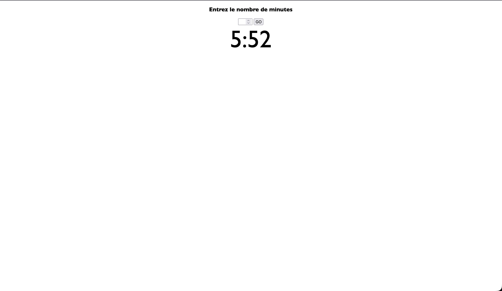

# ⏳ JS-Timer Engine - Asynchronous Time Management

**Projet d'étude** focalisé sur la gestion du temps asynchrone et la manipulation dynamique du DOM via les fonctions de timing JavaScript.
Une application de compte à rebours interactive permettant de transformer une entrée utilisateur en un cycle de décompte visuel précis.



## 🎯 Contexte & Objectifs Pédagogiques

Ce projet a été réalisé dans le cadre de mon **parcours de formation en autodidacte** pour maîtriser les fonctions d'ordonnancement (Scheduling) en JavaScript.

L'enjeu était de comprendre comment gérer un état qui évolue chaque seconde sans bloquer le reste de l'interface, tout en assurant une synchronisation parfaite entre les données (secondes totales) et l'affichage (MM:SS).

**Objectifs validés :**

- Utilisation et contrôle de la méthode **`setInterval()`**.
- Gestion du cycle de vie d'un intervalle avec **`clearInterval()`** pour éviter les conflits d'exécution.
- Application de **logique mathématique** (Modulo et Division entière) pour le formatage temporel.
- Manipulation du DOM en temps réel pour un feedback utilisateur immédiat.

## 🛠️ Stack Technique

- **Frontend :** HTML5, CSS3.
- **Scripting :** JavaScript Vanilla (ES6+).
- **Logique :** Algorithmique de conversion temporelle.

## ✨ Fonctionnalités Développées

### 1. Moteur de Décompte Asynchrone
Développement d'un algorithme qui décrémente le temps total seconde par seconde. Le moteur est capable de recalculer les minutes et secondes restantes à chaque itération pour maintenir un affichage cohérent.

### 2. Formatage Dynamique (UX)
Mise en place d'une logique de "padding" pour les secondes (affichage de "09" au lieu de "9") afin de garantir une interface stable et professionnelle, respectant les standards visuels des chronomètres.

### 3. Contrôle des Flux
Implémentation d'une sécurité permettant de réinitialiser tout décompte en cours lors de la soumission d'une nouvelle valeur, évitant ainsi la superposition de plusieurs intervalles (accélération anormale du temps).

## 🏗️ Architecture du Code

Le script repose sur une structure événementielle :
- **Entrée :** Capture des données via un formulaire HTML avec validation du type `number`.
- **Traitement :** Transformation de la valeur "Minutes" en un entier "TotalSecondes".
- **Sortie :** Mise à jour du nœud DOM `#countdownDisplay`.

## 🧠 Challenges Techniques Résolus

### La gestion des instances multiples
Un problème classique lors de la création d'un timer est le déclenchement de plusieurs compte à rebours simultanés si l'utilisateur clique plusieurs fois sur "GO".

- _Solution :_ Stockage de l'identifiant de l'intervalle dans une variable `interval` et appel systématique à `clearInterval(interval)` au début de chaque soumission. Cela garantit qu'une seule instance de décompte tourne à la fois.

### Logique de fin de cycle
Il fallait s'assurer que le programme s'arrête exactement à zéro et affiche un message clair.

- _Solution :_ Mise en place d'une structure conditionnelle vérifiant l'état des minutes et des secondes à chaque seconde, déclenchant l'arrêt du moteur (`clearInterval`) dès que la condition "0:00" est atteinte.

## ⚙️ Installation & Lancement

1. **Cloner le dépôt :**
```bash
git clone [https://github.com/EnzoRouet/JS-Timer_Engine]
```

2. **Lancer le projet :**
Ouvrez le fichier index.html dans votre navigateur.
